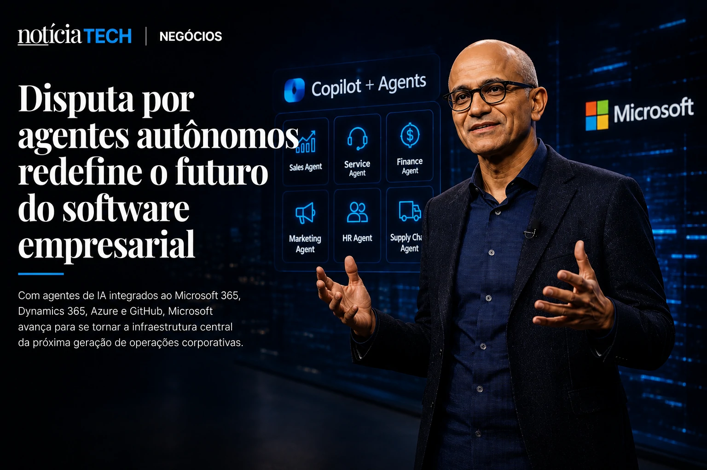

*Enquanto muitas empresas ainda tentam entender como usar inteligência artificial de forma prática, a **Microsoft** já começa a tratar agentes autônomos como a próxima camada operacional do mercado corporativo. Nos últimos dias, declarações e movimentações lideradas por **Satya Nadella** reforçaram um sinal importante para o setor B2B: a disputa da IA deixou de ser apenas sobre modelos generativos e passou a girar em torno de plataformas capazes de executar trabalho real dentro das empresas.*

A nova estratégia da **Microsoft** não envolve apenas produtividade. O objetivo agora é transformar agentes de IA em infraestrutura operacional para vendas, atendimento, análise de dados, desenvolvimento de software e automação empresarial.

Esse movimento pode acelerar uma mudança estrutural no mercado global de software corporativo.

## A estratégia de Satya Nadella mostra que agentes de IA estão virando o novo sistema operacional das empresas

A visão de **Satya Nadella** indica que os agentes de IA deixarão de funcionar apenas como assistentes conversacionais e passarão a operar como sistemas autônomos integrados aos fluxos corporativos.

Nos últimos dias, executivos da **Microsoft** reforçaram publicamente que a companhia quer posicionar o ecossistema do **Copilot** como uma camada central de execução operacional dentro das empresas. A estratégia conecta diretamente produtos como **Microsoft 365**, **Azure**, **GitHub Copilot**, **Dynamics 365** e automações empresariais baseadas em IA.

O movimento acontece em um momento em que gigantes da tecnologia disputam quem controlará a nova interface corporativa da IA.

A lógica estratégica é clara:

- quem controlar os agentes;
- controla os fluxos de trabalho;
- controla os dados;
- controla a produtividade;
- controla a distribuição de software corporativo.

A própria **Microsoft** já vem ampliando esse posicionamento há meses. O tema conversa diretamente com análises anteriores do NOTÍCIA TECH sobre a transformação dos agentes autônomos no ambiente empresarial:

- [A era dos agentes de IA já começou: como Microsoft, OpenAI e Google estão transformando empresas em sistemas autônomos](https://noticiatech.com.br/inteligencia-artificial/a-era-dos-agentes-de-ia-j%C3%A1-come%C3%A7ou-como-microsoft-openai-e-google-est%C3%A3o-transformando-empresas-em-sistemas-aut%C3%B4nomos/)

- [Empresas começam a criar cargos de AI Operations para controlar agentes autônomos](https://noticiatech.com.br/negocios/empresas-come%C3%A7am-a-criar-cargos-de-ai-operations-para-controlar-agentes-aut%C3%B4nomos/)

O que muda agora é a velocidade dessa transição.

A narrativa deixou de ser experimental.

Ela começa a entrar em escala corporativa.

### O que os agentes de IA realmente fazem dentro das empresas?

Os agentes corporativos são sistemas capazes de:

- executar tarefas sem intervenção humana constante;
- navegar entre plataformas;
- analisar documentos;
- responder clientes;
- gerar relatórios;
- tomar decisões operacionais;
- automatizar processos repetitivos;
- integrar múltiplos softwares corporativos.

Na prática, a promessa é reduzir drasticamente a dependência de operações manuais.

Isso explica por que o mercado de software empresarial começa a passar por uma reorganização silenciosa.

## A Microsoft quer transformar IA em camada invisível de produtividade corporativa

A nova fase da estratégia da **Microsoft** mostra que a empresa não quer apenas vender IA como ferramenta isolada. O objetivo é transformar inteligência artificial em infraestrutura invisível dentro das operações empresariais.

Esse movimento possui enorme impacto no mercado B2B porque redefine como empresas consomem software.

Historicamente, companhias precisavam:

- abrir plataformas;
- navegar dashboards;
- interpretar relatórios;
- executar tarefas manualmente.

Com agentes autônomos, parte dessas etapas começa a desaparecer.

O usuário deixa de operar software diretamente.

O software começa a operar sozinho.

Esse cenário ajuda a explicar por que o mercado global de IA corporativa deve ultrapassar centenas de bilhões de dólares nos próximos anos, segundo projeções de consultorias como **McKinsey**, **PwC** e **Gartner**.

A mudança também pressiona concorrentes como:

- **Google**;
- **OpenAI**;
- **Salesforce**;
- **Oracle**;
- **SAP**;
- **Amazon**;
- **Anthropic**.

Todas tentam ocupar o espaço de “camada operacional da IA corporativa”.

A disputa já não é apenas tecnológica.

Ela se tornou uma guerra pela infraestrutura do trabalho digital.

### Por que isso ameaça o modelo tradicional de software corporativo?

O avanço dos agentes autônomos cria um problema estratégico para empresas tradicionais de software:

se a IA consegue executar tarefas diretamente, parte da complexidade dos sistemas corporativos perde relevância.

Isso significa que:

- dashboards podem perder protagonismo;
- interfaces tradicionais podem diminuir;
- softwares isolados podem virar commodities;
- agentes podem centralizar operações.

Esse movimento já aparece em diversos setores.

O NOTÍCIA TECH vem acompanhando essa transformação em análises recentes:

- [AI Operating Systems: por que empresas começam a substituir softwares isolados por ecossistemas autônomos de IA](https://noticiatech.com.br/negocios/ai-operating-systems-por-que-empresas-come%C3%A7am-a-substituir-softwares-isolados-por-ecossistemas-aut%C3%B4nomos-de-ia/)

- [Empresas começam a substituir dashboards por copilotos analíticos movidos por IA generativa](https://noticiatech.com.br/negocios/empresas-come%C3%A7am-a-substituir-dashboards-por-copilotos-anal%C3%ADticos-movidos-por-ia-generativa/)

O impacto pode ser comparável à transformação causada pela computação em nuvem anos atrás.

Mas agora a velocidade parece maior.

## O mercado B2B começa a perceber que IA não é mais apenas ferramenta experimental

O principal sinal deixado pelas recentes movimentações da **Microsoft** é que a IA corporativa começa a sair do estágio de teste para entrar no núcleo operacional das empresas.

Durante muito tempo, empresas enxergaram IA como:

- recurso complementar;
- chatbot experimental;
- ferramenta de produtividade;
- apoio secundário.

Agora o mercado começa a tratar agentes autônomos como infraestrutura estratégica.

Essa mudança altera decisões de:

- tecnologia;
- investimentos;
- contratação;
- segurança;
- governança;
- arquitetura operacional.

Ela também cria novas preocupações.

### O que passa a preocupar as empresas nessa nova corrida da IA?

Conforme agentes ganham autonomia, surgem novos desafios:

- governança operacional;
- segurança de dados;
- controle de permissões;
- rastreabilidade;
- supervisão humana;
- dependência tecnológica;
- integração entre múltiplas IAs.

Isso explica por que cresce o debate sobre:

- AI Operations;
- governança de IA;
- Shadow AI;
- ecossistemas híbridos de agentes.

O próprio NOTÍCIA TECH já mostrou como esse problema começa a crescer dentro das empresas:

- [Shadow AI: empresas descobrem que uso invisível de inteligência artificial já virou risco operacional em 2026](https://noticiatech.com.br/negocios/shadow-ai-empresas-descobrem-que-uso-invis%C3%ADvel-de-intelig%C3%AAncia-artificial-j%C3%A1-virou-risco-operacional-em-2026/)

- [Governança de IA vira prioridade para empresas](https://noticiatech.com.br/inteligencia-artificial/governanca-ia-prioridade-empresas/)

A próxima fase da disputa da IA provavelmente não será vencida apenas pelo melhor modelo generativo.

Ela tende a ser vencida pela empresa que conseguir integrar agentes autônomos diretamente no funcionamento diário das organizações.

E hoje, poucas companhias parecem tão posicionadas para isso quanto a **Microsoft** de **Satya Nadella**.

---