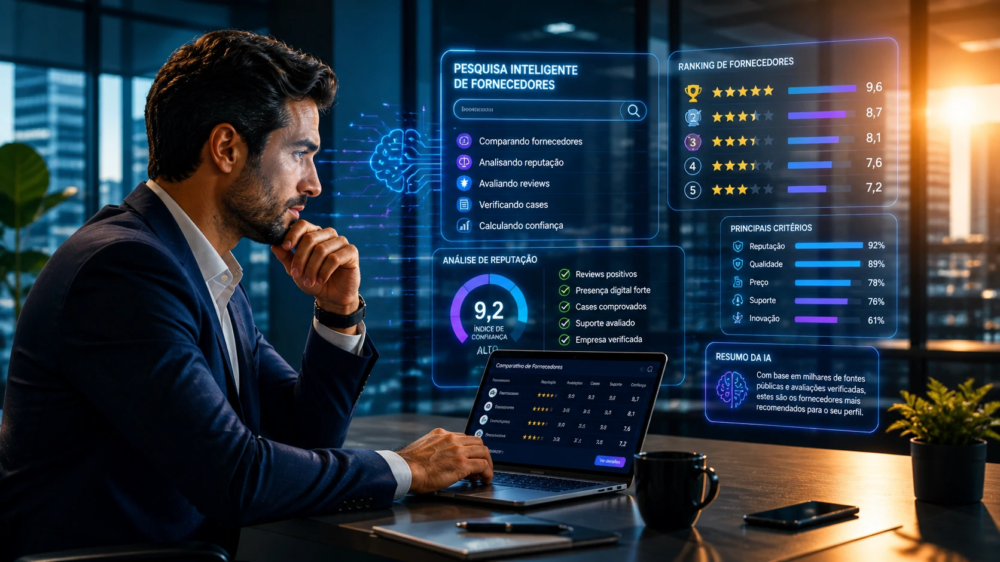

Empresas brasileiras ainda investem pesado em prospecção comercial, SDRs e outbound, mas o comportamento do comprador mudou de forma silenciosa — e talvez definitiva. Antes mesmo da primeira reunião, a decisão já está sendo moldada por inteligência artificial, reputação digital e conteúdo estruturado.

Uma nova dinâmica está transformando o mercado: agora, a IA participa da pré-venda do lado do comprador.

## A nova jornada de compra B2B começa sem vendedor

Durante anos, o modelo tradicional de vendas B2B seguia uma lógica previsível:

o comprador identificava um problema, buscava soluções, entrava em contato com fornecedores e iniciava reuniões comerciais.

Mas isso mudou.

Hoje, ferramentas como **__OpenAI__**, **__Microsoft__ Copilot**, **__Google__ Gemini** e buscadores com IA passaram a atuar como consultores preliminares de compra.

Segundo levantamento citado pela WebFX, 94% dos compradores B2B já utilizam LLMs no processo de compra e 83% definem critérios de aquisição antes mesmo de falar com um vendedor. Isso significa que grande parte da persuasão comercial agora acontece antes do time comercial entrar em cena. :contentReference[oaicite:4]{index=4}

Na prática:

a IA compara fornecedores  
resume avaliações  
analisa reputação  
organiza diferenciais  
e gera shortlists

Ou seja: o vendedor chega depois.

## O problema para empresas: invisibilidade algorítmica

Se antes o desafio era aparecer no Google, agora o desafio é aparecer na resposta da IA.

E isso muda completamente o jogo.

Quando um comprador pergunta:

"quais são os melhores CRMs para empresas médias no Brasil?"

ou

"qual ferramenta de automação de marketing tem melhor suporte?"

a IA monta uma resposta baseada em sinais como:

site oficial  
reviews públicos  
presença em comunidades  
cases documentados  
conteúdo educativo  
menções externas  
autoridade temática

Se sua empresa não possui esses sinais estruturados, ela pode simplesmente não existir para esse comprador.

Isso cria um fenômeno novo:

empresas tecnicamente boas, mas comercialmente invisíveis.

E isso pode ser fatal.

## Reputação virou infraestrutura comercial

A pesquisa da B2B Stack com mais de 19 mil usuários mostra um comprador brasileiro mais criterioso, mais comparativo e mais dependente de validação social.

Esse dado é importante.

Porque IA não inventa confiança.

Ela reorganiza confiança.

Se sua marca tem avaliações ruins, baixa presença digital ou mensagens inconsistentes, a IA amplifica isso.

Se sua marca tem boa reputação, cases claros e presença forte, a IA também amplifica.

Na prática, reputação virou ativo operacional.

Não é mais branding.

É pipeline.

## O Brasil acelera — e isso muda a pressão competitiva

A **International Data Corporation (IDC)** estima que os investimentos em IA no Brasil devem atingir US$ 3,4 bilhões em 2026, com crescimento acima de 30%.

Esse número não é apenas sobre adoção tecnológica.

É sobre mudança de infraestrutura competitiva.

Se compradores estão usando IA para avaliar fornecedores e fornecedores estão usando IA para vender melhor, cria-se um ambiente de dupla aceleração.

Quem demora perde eficiência dos dois lados.

Isso vale especialmente para empresas de:

software  
serviços corporativos  
consultoria  
logística  
marketing  
RH  
indústria

## Digital Sales Rooms: o novo campo de batalha comercial

Outro movimento relevante é a ascensão das Digital Sales Rooms.

Segundo projeções de mercado, cerca de 30% dos ciclos de vendas B2B em 2026 já estão sendo conduzidos com esse modelo.

Na prática, isso significa que a venda sai do formato linear (ligações, e-mails e PDFs) e entra num ambiente digital centralizado onde comprador e vendedor compartilham:

documentos  
propostas  
vídeos  
comparativos  
ROI calculators  
cronogramas  
FAQs

Esse formato conversa diretamente com o novo comprador orientado por IA.

Porque reduz atrito.

E acelera decisão.

## O vendedor B2B não morreu — mas mudou de função

Muita gente interpreta esse cenário como ameaça para vendas.

É um erro.

O vendedor continua relevante.

Mas sua função mudou.

Antes:

educava o mercado.

Agora:

valida decisões já parcialmente tomadas.

Antes:

introduzia soluções.

Agora:

remove objeções específicas.

Antes:

controlava informação.

Agora:

interpreta informação.

O comercial deixou de ser a porta de entrada.

Virou acelerador de fechamento.

## O que empresas brasileiras precisam fazer agora

O impacto disso é imediato.

As empresas que quiserem continuar competitivas precisam revisar cinco pilares:

### 1. Estruturar presença digital para IA

Conteúdo técnico  
páginas claras  
provas concretas  
dados verificáveis

IA prioriza clareza.

### 2. Construir reputação distribuída

Reviews  
testemunhos  
plataformas de avaliação  
menções de mercado

Confiança descentralizada importa.

### 3. Integrar marketing e vendas

Se a IA faz parte do início da jornada, marketing passou a influenciar vendas de forma ainda mais direta.

A separação entre os times fica menos eficiente.

### 4. Revisar o funil comercial

Se o lead chega mais informado, o processo comercial precisa acompanhar esse novo nível de maturidade.

Script antigo perde força.

### 5. Monitorar como sua marca aparece na IA

Essa talvez seja a nova disciplina de marketing B2B.

Entender:

o que a IA fala da sua empresa  
como compara sua marca  
quais concorrentes aparecem junto  
quais objeções ela destaca

Esse monitoramento tende a virar rotina.

## A próxima disputa B2B será por presença algorítmica

O mercado está entrando numa fase onde a primeira impressão da sua empresa pode não vir do seu vendedor.

Pode vir de uma IA.

E isso muda tudo.

Porque significa que confiança, autoridade e clareza deixaram de ser diferenciais de marketing.

Viraram infraestrutura de vendas.

As empresas brasileiras que entenderem isso cedo podem capturar vantagem competitiva real.

As que ignorarem podem descobrir tarde demais que estavam perdendo negócios antes mesmo da primeira reunião.