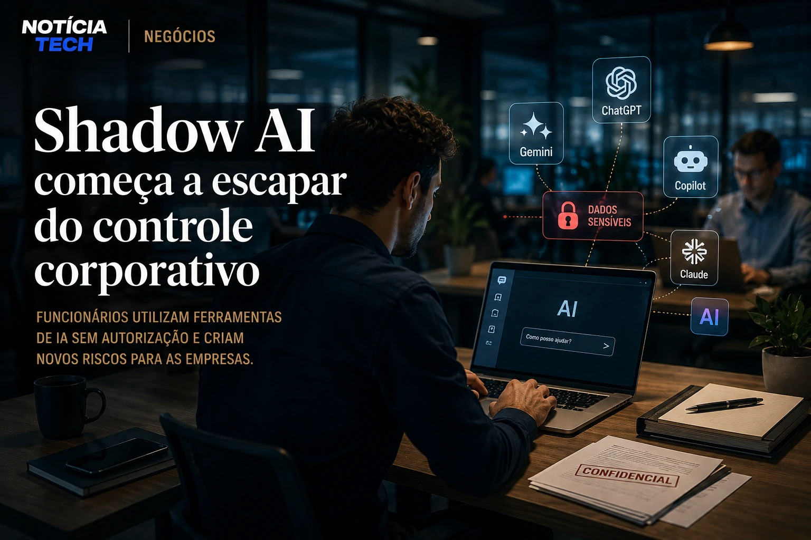
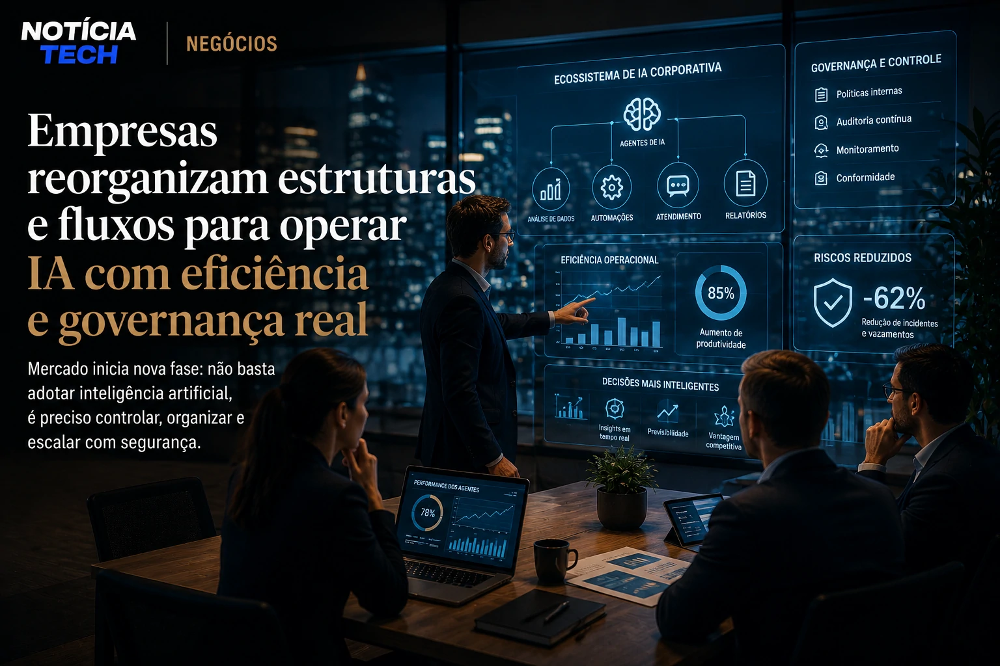

*Enquanto a corrida corporativa pela inteligência artificial acelera em ritmo recorde, um fenômeno silencioso começa a ganhar força dentro das empresas: funcionários utilizando ferramentas de IA sem autorização formal da companhia. O movimento, conhecido globalmente como **Shadow AI**, já começa a alterar estratégias de governança, segurança digital e gestão operacional em grandes organizações.*

*O problema deixou de ser apenas tecnológico. Em 2026, a expansão da IA generativa dentro das empresas passou a criar uma nova camada de risco invisível, envolvendo vazamento de dados, decisões automatizadas sem supervisão e dependência crescente de plataformas externas.*

## Shadow AI começa a escapar do controle corporativo

O conceito de **Shadow AI** segue a mesma lógica do antigo “Shadow IT”, quando colaboradores adotavam softwares externos sem aprovação das equipes de tecnologia. A diferença é que agora o impacto se tornou muito maior.

Ferramentas como assistentes generativos, copilotos de produtividade, automações inteligentes e plataformas de análise começaram a ser utilizadas diretamente por equipes comerciais, marketing, RH e operações sem qualquer padronização interna.

Na prática, empresas descobriram que boa parte de seus colaboradores já utiliza IA diariamente, mesmo em organizações que ainda não possuem uma estratégia oficial de adoção.

Esse movimento ganhou força porque a nova geração de ferramentas generativas reduziu drasticamente a barreira técnica. Hoje, praticamente qualquer profissional consegue automatizar tarefas, criar relatórios, analisar dados e gerar apresentações utilizando IA.

O problema é que muitas dessas interações envolvem:

- dados internos;
- contratos corporativos;
- informações estratégicas;
- dados financeiros;
- documentos confidenciais.

Em muitos casos, os próprios executivos descobriram tarde demais que equipes inteiras já estavam integrando IA ao fluxo operacional.

Esse cenário se conecta diretamente ao avanço da chamada industrialização da inteligência artificial nas empresas brasileiras, tema que já vem transformando o mercado corporativo em ritmo acelerado.

Veja também:

- [2026 virou o ano da industrialização da IA no Brasil](https://noticiatech.com.br/inteligencia-artificial/2026-virou-o-ano-da-industrializa%C3%A7%C3%A3o-da-ia-no-brasil/)
- [Empresas começam a substituir softwares tradicionais por agentes de IA](https://noticiatech.com.br/automacao/empresas-come%C3%A7am-a-substituir-softwares-tradicionais-por-agentes-de-ia/)

### O crescimento invisível da IA corporativa

Um dos fatores que mais preocupam especialistas é justamente a velocidade da adoção.

Enquanto projetos tradicionais de software normalmente exigiam meses de implantação, plataformas de IA conseguem entrar na rotina operacional em poucas horas.

Isso cria um fenômeno novo dentro das corporações:

- a tecnologia chega antes da governança;
- a produtividade cresce antes da regulamentação;
- os riscos aparecem antes da padronização.

Empresas que antes controlavam rigidamente seus sistemas agora enfrentam um ambiente onde colaboradores conseguem conectar ferramentas externas diretamente às operações internas.

## Segurança, compliance e governança viram prioridade estratégica

O avanço da **Shadow AI** começa a pressionar áreas de:

- segurança da informação;
- compliance;
- jurídico;
- governança de dados;
- gestão de risco.

O principal motivo é simples: muitas empresas ainda não sabem exatamente quais ferramentas de IA estão sendo utilizadas internamente.

Em organizações maiores, o desafio cresce ainda mais.

Equipes distribuídas utilizam múltiplas plataformas simultaneamente, criando um ambiente fragmentado onde informações estratégicas podem circular sem supervisão adequada.

Isso fez crescer a preocupação com:

### Vazamento indireto de dados

Muitas plataformas generativas armazenam prompts e interações para treinamento ou melhoria de sistemas.

Quando funcionários inserem:

- contratos;
- estratégias comerciais;
- códigos proprietários;
- dados financeiros;
- informações de clientes;

as empresas podem perder controle sobre informações críticas.

### Dependência operacional invisível

Outro ponto crítico é que diversos fluxos operacionais começam a depender de IA sem documentação oficial.

Em algumas empresas, profissionais criaram automações próprias para tarefas essenciais sem que a liderança tivesse conhecimento técnico sobre o funcionamento dessas rotinas.

Isso cria um novo risco operacional:

- ausência de rastreabilidade;
- baixa previsibilidade;
- dependência de plataformas externas;
- falhas de continuidade operacional.

O mercado já começa a responder a esse novo cenário com estruturas específicas de gestão e supervisão operacional para IA.

Veja também:

- [Empresas começam a criar cargos de AI Operations para controlar agentes autônomos](https://noticiatech.com.br/negocios/empresas-come%C3%A7am-a-criar-cargos-de-ai-operations-para-controlar-agentes-aut%C3%B4nomos/)
- [Empresas descobrem que IA sem organização interna aumenta custos e reduz produtividade](https://noticiatech.com.br/negocios/empresas-descobrem-que-ia-sem-organiza%C3%A7%C3%A3o-interna-aumenta-custos-e-reduz-produtividade/)

### A nova fase da governança corporativa

A tendência agora não é impedir o uso de IA.

O movimento mais forte do mercado aponta para:

- criação de políticas internas;
- ambientes seguros de IA;
- plataformas corporativas homologadas;
- treinamento operacional;
- auditoria contínua de agentes inteligentes.

Empresas perceberam que bloquear completamente ferramentas generativas se tornou praticamente inviável.

A nova prioridade passou a ser criar governança suficiente para permitir inovação sem perder controle operacional.

## O mercado começa a reorganizar estruturas inteiras ao redor da IA

O crescimento da **Shadow AI** também revela uma transformação maior acontecendo no mercado corporativo.

A inteligência artificial deixou de ser apenas uma ferramenta complementar.

Agora ela começa a redefinir:

- estrutura operacional;
- tomada de decisão;
- produtividade;
- gestão corporativa;
- fluxo de trabalho;
- organização das equipes.

Em muitas empresas, colaboradores passaram a operar como “gestores de IA”, supervisionando múltiplos agentes inteligentes ao mesmo tempo.

Isso altera inclusive a lógica tradicional dos softwares corporativos.

Em vez de navegar manualmente por dezenas de sistemas, profissionais começam a utilizar copilotos capazes de centralizar tarefas, relatórios e execução operacional.

Esse movimento já aparece em diferentes setores do mercado digital.

Veja também:

- [Empresas começam a substituir dashboards por copilotos analíticos movidos por IA generativa](https://noticiatech.com.br/negocios/empresas-come%C3%A7am-a-substituir-dashboards-por-copilotos-anal%C3%ADticos-movidos-por-ia-generativa/)
- [Cursor, Windsurf e GitHub Copilot estão mudando o mercado de desenvolvimento](https://noticiatech.com.br/inteligencia-artificial/cursor-windsurf-e-github-copilot-est%C3%A3o-mudando-o-mercado-de-desenvolvimento/)

### A próxima disputa será por controle operacional da IA

A primeira fase da corrida da IA foi baseada em adoção.

Agora o mercado entra em uma segunda etapa:

quem conseguir controlar, organizar e escalar inteligência artificial de forma eficiente terá vantagem operacional relevante.

Esse novo cenário pode criar uma divisão clara entre empresas que:

- apenas utilizam IA;
- e empresas que conseguem operar IA em larga escala com governança real.

No longo prazo, especialistas acreditam que a gestão da inteligência artificial se tornará tão importante quanto hoje é a gestão financeira ou a segurança digital.

A diferença é que a transformação acontece em uma velocidade muito maior.

Enquanto muitas empresas ainda discutem políticas internas, colaboradores já estão automatizando operações inteiras silenciosamente.

E isso pode fazer da **Shadow AI** um dos maiores desafios corporativos da nova economia digital.