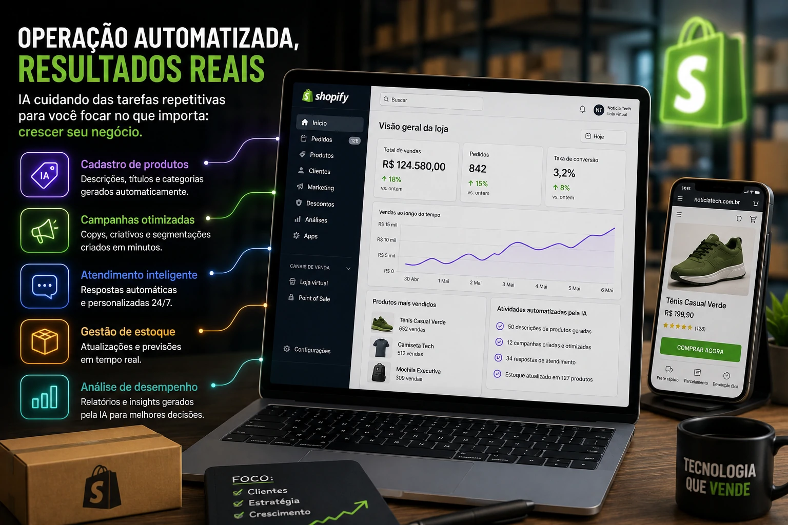

*Criar uma loja virtual costumava exigir equipe, tempo e conhecimento técnico. Agora, com inteligência artificial integrada na operação, empresas menores conseguem reduzir custos, acelerar processos e competir com estruturas maiores.*

A inteligência artificial deixou de ser apenas uma ferramenta de suporte e começou a assumir funções centrais dentro do comércio digital. A nova movimentação da **__Shopify__** reforça esse cenário: a plataforma está acelerando a integração de IA para criação de lojas, campanhas, descrições de produtos e automações operacionais.

## O que muda com a IA da Shopify

A nova fase da **__Shopify__** concentra inteligência artificial em áreas críticas da operação.

### Cadastro automatizado de produtos

Empresas conseguem gerar descrições completas, títulos otimizados e categorizações automaticamente.

Na prática:

- menos tempo operacional  
- padronização de catálogo  
- melhoria de SEO interno  

Isso impacta diretamente produtividade.

### Campanhas mais rápidas

Criativos, copies e segmentações podem ser estruturados em minutos.

Antes:

- briefing  
- criação  
- revisão  
- publicação  

Agora:

- IA gera base inicial  
- operador ajusta  
- campanha vai ao ar  

Para negócios menores, isso reduz dependência externa e acelera execução.

## Pequenas empresas ganham escala operacional

Um dos maiores gargalos do varejo digital brasileiro é operação.

Muitas pequenas empresas travam em:

- cadastro manual  
- gestão de campanhas  
- atendimento repetitivo  
- atualização de estoque  
- análise de performance  

Com IA embarcada, o ganho não é apenas velocidade.

É estrutura.

Uma pequena operação pode funcionar com lógica operacional próxima de empresas maiores.

Isso muda a capacidade competitiva do pequeno negócio.

## O impacto real para empresas brasileiras

No Brasil, o comércio digital continua pressionado por margem.

Custos de aquisição subiram.

A concorrência aumentou.

E eficiência virou sobrevivência.

A integração de IA dentro de plataformas como a **__Shopify__** reduz três dores clássicas:

### Tempo operacional

Menos tarefas repetitivas.

Mais foco em crescimento.

### Custo de produção

Menor necessidade de terceirização inicial.

Especialmente em marketing.

### Velocidade de teste

Empresas conseguem validar campanhas, produtos e ofertas mais rápido.

Esse ponto é crítico.

Quem testa mais rápido, aprende mais rápido.

## O risco de depender demais da automação

Automação não substitui estratégia.

Esse é um erro comum.

IA acelera execução.

Mas ainda exige:

- visão comercial  
- posicionamento  
- análise de mercado  
- leitura de comportamento do cliente  

Ferramentas ajudam.

Decisão continua humana.

Esse ponto conversa diretamente com nossa análise sobre diversificação tecnológica em ambientes corporativos:

[Microsoft e OpenAI mudam parceria e deixam alerta para empresas: depender de uma única IA pode ser um risco](https://noticiatech.com.br/negocios/microsoft-e-openai-mudam-parceria-e-deixam-alerta-para-empresas-sobre-o-risco-de-depender-de-uma-%C3%BAnica-ia/)

## O novo padrão competitivo do e-commerce

A tendência é clara:

IA integrada na operação será padrão.

Não diferencial.

Empresas que entenderem isso cedo podem operar com mais eficiência, menor custo e maior velocidade.

No e-commerce moderno, ganhar não significa apenas vender mais.

Significa operar melhor.

E isso está cada vez mais automatizado.
