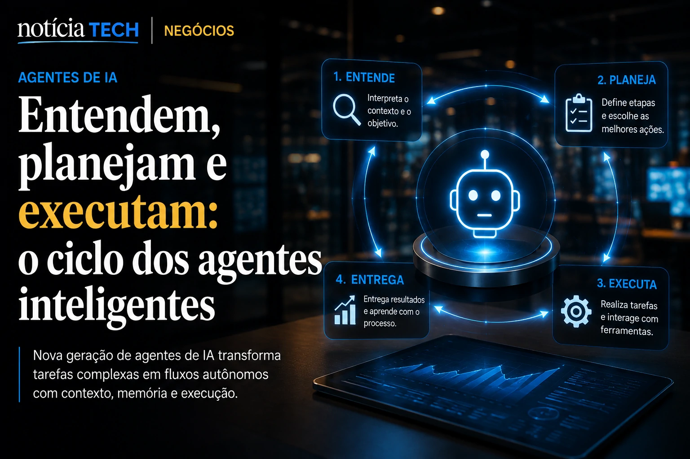
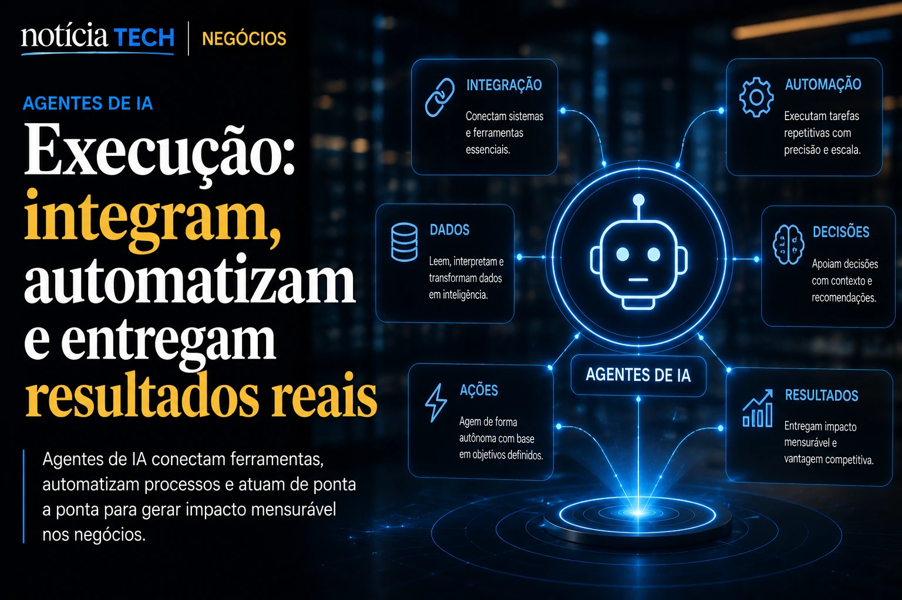

*O avanço da inteligência artificial deixou de ser apenas uma corrida por modelos mais poderosos. Agora, a disputa envolve quem controlará a próxima interface entre pessoas, empresas e tecnologia. Nesse cenário, **Sundar Pichai** vem posicionando o **Google** para uma transformação que pode alterar profundamente a forma como negócios operam, vendem e se relacionam com clientes na economia digital.*

## A estratégia de Sundar Pichai vai além dos modelos de IA

A estratégia de **Sundar Pichai** não está focada apenas em criar modelos mais avançados. O objetivo é transformar a inteligência artificial em uma camada operacional presente em todo o ecossistema do **Google**.

Durante os últimos ciclos de anúncios da companhia, ficou evidente que ferramentas como **Gemini**, pesquisa inteligente, produtividade corporativa e automação passaram a funcionar como partes de um mesmo sistema.

### Da busca para a execução

Durante décadas, mecanismos de busca ajudaram usuários a encontrar informações.

Agora, os agentes inteligentes começam a executar tarefas completas, reduzindo etapas entre intenção e resultado.

Essa mudança pode transformar a internet em um ambiente orientado por ações e não apenas por cliques.

### O novo posicionamento do Google

O movimento liderado por **Sundar Pichai** sugere que o **Google** pretende ocupar uma posição central na infraestrutura de agentes corporativos.

Em vez de competir apenas com buscadores tradicionais, a empresa disputa espaço com plataformas capazes de automatizar trabalho, atendimento, produtividade e tomada de decisão.

## Agentes de IA podem se tornar a principal interface dos negócios

Agentes de IA estão evoluindo para se tornar a camada intermediária entre usuários e sistemas corporativos.

Essa transformação pode alterar a maneira como empresas vendem produtos, distribuem conteúdo e oferecem serviços.

### O fim das jornadas digitais tradicionais

Historicamente, consumidores acessavam sites, aplicativos e marketplaces para concluir tarefas.

Com agentes inteligentes, parte dessas interações poderá ocorrer sem navegação direta.

O usuário simplesmente descreve um objetivo e a IA executa etapas em seu nome.

Esse cenário se conecta diretamente às mudanças discutidas em [AI Search Engines começam a substituir sites tradicionais e criam nova crise silenciosa para publishers digitais](https://noticiatech.com.br/inteligencia-artificial/ai-search-engines-come%C3%A7am-a-substituir-sites-tradicionais-e-criam-nova-crise-silenciosa-para-publishers-digitais/).

### Empresas precisarão ser compreendidas por IA

A nova disputa não envolve apenas visibilidade para pessoas.

Negócios precisarão ser compreendidos por sistemas inteligentes capazes de recomendar produtos, fornecedores e serviços.

Esse fenômeno reforça conceitos já observados em [B2A: a nova fronteira dos negócios onde empresas precisam ser entendidas por inteligências artificiais](https://noticiatech.com.br/inteligencia-artificial/b2a-a-nova-fronteira-dos-neg%C3%B3cios-onde-empresas-precisam-ser-entendidas-por-intelig%C3%AAncias-artificiais/).

## O impacto da visão de Pichai no mercado corporativo

A visão de **Sundar Pichai** possui implicações que vão muito além do consumidor final.

Empresas começam a perceber que a IA será uma infraestrutura estratégica semelhante ao papel desempenhado pela nuvem nos últimos anos.

### Produtividade passa a ser automatizada

Ferramentas corporativas estão sendo integradas a modelos capazes de interpretar contexto, recuperar informações e executar fluxos de trabalho.

A consequência é uma redução crescente de tarefas operacionais repetitivas.

Esse movimento se aproxima da evolução observada em [A era dos agentes de IA já começou: como Microsoft, OpenAI e Google estão transformando empresas em sistemas autônomos](https://noticiatech.com.br/inteligencia-artificial/a-era-dos-agentes-de-ia-j%C3%A1-come%C3%A7ou-como-microsoft-openai-e-google-est%C3%A3o-transformando-empresas-em-sistemas-aut%C3%B4nomos/).

### Dados passam a valer mais

Quanto mais inteligentes se tornam os agentes, mais importante se torna a qualidade dos dados corporativos.

Empresas com processos desorganizados podem enfrentar dificuldades para extrair valor real da IA.

Organizações que estruturarem conhecimento interno, governança e contexto operacional tendem a capturar vantagens competitivas maiores.

## O que a aposta de Sundar Pichai revela sobre o futuro dos negócios

A principal mensagem da estratégia de **Sundar Pichai** é que a próxima fase da transformação digital será orientada por agentes inteligentes.

O mercado está migrando de softwares isolados para ecossistemas capazes de compreender contexto, executar ações e colaborar com usuários.

### A disputa deixa de ser por aplicativos

Durante anos, empresas competiram pela atenção dentro de aplicativos e plataformas.

Nos próximos ciclos, a disputa poderá ocorrer dentro das próprias interfaces de IA.

Isso altera marketing, vendas, atendimento, produtividade e descoberta de produtos.

### Uma nova infraestrutura econômica

Assim como a computação em nuvem redefiniu a tecnologia corporativa, agentes inteligentes podem redefinir como organizações operam.

A velocidade com que **Google**, **Microsoft**, **OpenAI** e outros grandes players estão avançando indica que a mudança já está em andamento.

Para líderes empresariais, a questão não é mais se agentes de IA terão impacto relevante, mas qual posição sua organização ocupará quando essas interfaces se tornarem o principal ponto de contato entre pessoas, sistemas e mercados.

---
