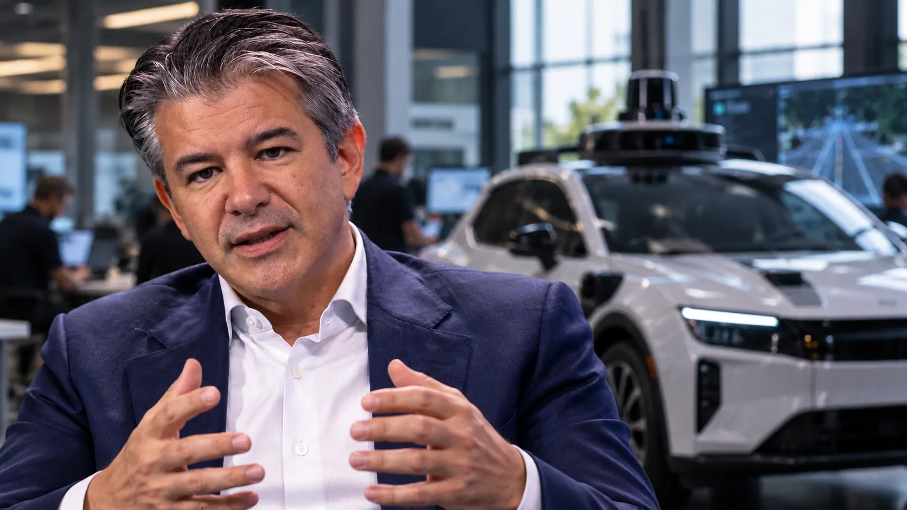
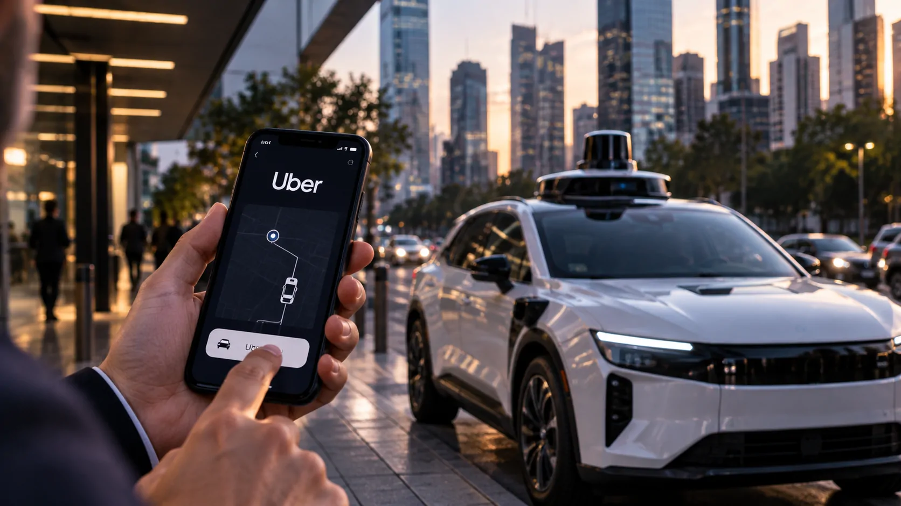

*Travis Kalanick está voltando a se aproximar de um mercado que ajudou a transformar, mas a aposta agora é diferente: em vez de depender de motoristas conectados a uma plataforma, sua nova empresa pode colocar **inteligência artificial, robótica e veículos autônomos** no centro da estratégia. Depois de levantar US$ 1,7 bilhão, a Atoms começa a revelar o que pretende fazer com esse capital.*

## Travis Kalanick volta ao transporte quase uma década depois de deixar a Uber

Travis Kalanick está novamente se aproximando do setor de transporte, desta vez por meio da **Atoms**, empresa que vem sendo posicionada em torno de inteligência artificial física, robótica e automação.

O movimento chama atenção porque Kalanick foi um dos fundadores da **Uber** e deixou o cargo de CEO em 2017. Quase uma década depois, sua nova empresa começa a construir uma estratégia que pode colocá-lo novamente diante de um dos mercados que ajudou a transformar.

A diferença é tecnológica. A primeira grande aposta de Kalanick foi conectar passageiros e motoristas por software. Agora, a possibilidade é utilizar software para controlar máquinas capazes de realizar fisicamente o transporte.

### O que mudou desde a saída da Uber

O mercado de mobilidade também mudou. Veículos autônomos deixaram de ser apenas projetos experimentais e passaram a receber investimentos de empresas como Waymo, Tesla e Amazon, enquanto plataformas de transporte tentam descobrir como incorporar essa tecnologia aos seus próprios negócios.

Nesse ambiente, a experiência anterior de Kalanick pode ganhar novo valor. A questão não é simplesmente voltar ao transporte, mas participar de uma possível mudança na infraestrutura que sustenta o transporte sob demanda.

### A aposta agora é na autonomia física

A Atoms não se apresenta apenas como uma empresa de robotáxis. A estratégia envolve **IA física e automação industrial**, o que permite conectar transporte a outras aplicações.

Essa amplitude é importante porque reduz a necessidade de interpretar o movimento como uma simples tentativa de repetir a história da Uber. A nova tese parece ser mais ampla: usar software, robótica e autonomia para controlar operações no mundo físico.

## A Atoms levantou US$ 1,7 bilhão para acelerar essa estratégia

*O capital de US$ 1,7 bilhão amplia a capacidade da Atoms de investir em inteligência artificial física, automação e veículos autônomos.*

A Atoms ganhou capacidade financeira para executar sua estratégia depois de levantar **US$ 1,7 bilhão** em uma rodada de investimentos. O tamanho do capital muda a escala das possibilidades para uma empresa que ainda vinha mantendo relativamente poucos detalhes públicos sobre seus próximos passos.

O dinheiro pode financiar contratação de especialistas, desenvolvimento tecnológico e aquisições. Segundo relatos recentes, a empresa estaria preparando justamente uma expansão de sua equipe e avaliando novos negócios capazes de acelerar sua presença em autonomia.

### Por que US$ 1,7 bilhão muda o jogo

Uma rodada desse tamanho permite que a Atoms avance por diferentes frentes simultaneamente, em vez de depender exclusivamente de desenvolvimento orgânico.

Em mercados de tecnologia física, isso pode ser particularmente relevante. Comprar empresas já especializadas ou contratar equipes experientes pode reduzir anos de desenvolvimento e colocar ativos tecnológicos prontos dentro da nova estrutura.

### A estratégia não está limitada aos robotáxis

A própria natureza da Atoms exige cautela na interpretação. Os robotáxis aparecem como uma possibilidade relevante, mas os planos da companhia são mais amplos e incluem aplicações de automação em setores como mineração e transporte.

Por isso, o investimento deve ser entendido como uma aposta em **autonomia aplicada ao mundo físico**, e não simplesmente como uma nova empresa de carros autônomos tentando disputar diretamente com todas as companhias do setor.

## A aquisição da Pronto aproxima Kalanick novamente da tecnologia autônoma

Um dos movimentos que ajudam a explicar a nova estratégia foi a aquisição da **Pronto**, empresa fundada por Anthony Levandowski e especializada em veículos autônomos para ambientes industriais e mineração.

A operação é importante porque coloca dentro da Atoms conhecimento técnico diretamente relacionado à autonomia. Em vez de começar do zero, a empresa passa a contar com uma estrutura que já desenvolvia tecnologia para máquinas capazes de operar sem condução humana em ambientes específicos.

### Anthony Levandowski volta ao centro da história

Levandowski também possui uma relação histórica com a antiga estratégia de veículos autônomos da Uber. Ele havia trabalhado anteriormente no desenvolvimento de tecnologia de direção autônoma e chegou a liderar a Otto, empresa adquirida pela Uber em 2016.

A presença de Levandowski na nova estrutura cria uma conexão incomum entre duas fases da história de Kalanick: a antiga tentativa da Uber de desenvolver autonomia e a atual estratégia da Atoms.

### Da mineração para o transporte

A experiência da Pronto não significa que a tecnologia desenvolvida para mineração possa simplesmente ser transferida para ruas urbanas.

Os ambientes são diferentes, assim como os requisitos de segurança, regulamentação, mapas, interação com pedestres e comportamento diante de outros veículos. Ainda assim, a experiência acumulada em autonomia industrial pode fornecer conhecimento importante para uma estratégia mais ampla.

## Uber e Atoms podem voltar a trabalhar juntas no mercado de robotáxis

*Uma eventual parceria entre Atoms e Uber poderia combinar tecnologia autônoma com uma plataforma que já possui escala no transporte sob demanda.*

A possibilidade mais simbólica do movimento é justamente uma eventual aproximação entre **Uber e Atoms**. Segundo relatos, as empresas conversaram sobre como a tecnologia de robotáxis da Atoms poderia ser utilizada pela plataforma de transporte.

A hipótese é especialmente relevante porque coloca Kalanick novamente diante da empresa que ajudou a fundar. A diferença é que, desta vez, a relação poderia ocorrer como parceria tecnológica, investimento ou integração, e não como comando executivo.

### A Uber já precisa de tecnologia autônoma

Para a Uber, veículos autônomos representam uma questão estratégica porque a empresa pode continuar funcionando como plataforma de demanda mesmo quando parte dos veículos deixar de depender de motoristas humanos.

Isso cria uma divisão potencial de funções: empresas especializadas desenvolvem a autonomia, enquanto plataformas de mobilidade podem concentrar-se em distribuição, demanda, pagamentos e relacionamento com passageiros.

### A conversa não significa um acordo fechado

É importante separar possibilidade de fato consumado. As informações disponíveis apontam para **conversas sobre tecnologia**, não para uma operação definitiva de robotáxis da Atoms dentro da Uber.

Essa distinção é central para entender o estágio atual do projeto. A Atoms parece estar construindo as capacidades necessárias para disputar esse mercado, mas ainda não há base para afirmar que a empresa já tenha lançado uma operação comercial de robotáxis.

## O verdadeiro movimento de Kalanick pode ser maior que os carros autônomos

O elemento mais interessante da estratégia é que veículos autônomos podem representar apenas uma parte de uma tese maior sobre **inteligência artificial física**.

Kalanick descreveu a Atoms como uma tentativa de levar software para o mundo físico. Nesse modelo, mineração, transporte e outras operações podem ser tratados como problemas de automação que envolvem máquinas, infraestrutura e inteligência artificial.

### A autonomia está saindo do laboratório

A mudança no mercado é relevante porque sistemas autônomos começam a deixar ambientes controlados e avançar para operações comerciais.

O avanço de robotáxis, caminhões autônomos e máquinas industriais mostra que a disputa não envolve apenas criar modelos de IA mais inteligentes. Também é necessário transformar essa inteligência em sistemas capazes de perceber ambientes, tomar decisões e executar tarefas com segurança.

### Capital e execução passam a ser decisivos

O caso da Atoms também mostra por que o financiamento é tão importante nesse setor. Desenvolver tecnologia autônoma exige hardware, software, dados, testes, infraestrutura e equipes especializadas.

Isso cria uma vantagem para empresas capazes de levantar grandes quantidades de capital e adquirir competências rapidamente. O desafio, porém, permanece: dinheiro pode acelerar desenvolvimento, mas não elimina barreiras regulatórias, técnicas e operacionais.

## O retorno de Kalanick acontece quando o mercado de robotáxis começa a amadurecer

*O próximo capítulo da mobilidade autônoma pode envolver não apenas quem opera robotáxis, mas também quem fornece a tecnologia que permite a autonomia.*

A nova aposta de Travis Kalanick acontece em um momento particularmente interessante para a mobilidade autônoma. **Waymo, Tesla, Zoox e outras empresas** estão ampliando testes ou operações, enquanto plataformas de transporte procuram maneiras de participar da próxima etapa do mercado.

Nesse cenário, a Atoms não precisa necessariamente construir sozinha uma gigantesca rede de robotáxis para se tornar relevante. Uma estratégia baseada em tecnologia, licenciamento, parcerias e aquisições poderia permitir que a empresa ocupasse uma camada diferente da cadeia.

### O que empresas de tecnologia devem observar

O caso também reforça uma mudança importante no mercado de IA: o valor está migrando de modelos puramente digitais para sistemas capazes de interagir com o mundo físico.

Essa transição exige uma combinação de **software, robótica, sensores, dados, infraestrutura e automação**. Para empresas, isso abre uma nova frente de investimento, mas também aumenta a complexidade de implantação e governança.

Esse movimento ocorre em paralelo ao avanço da IA corporativa. No Brasil, por exemplo, **50% das empresas já utilizam IA**, mas apenas 15% chegaram ao estágio avançado, mostrando que transformar inteligência artificial em capacidade operacional continua sendo um desafio. **[Entenda por que a adoção de IA já alcançou metade das empresas brasileiras, mas a maturidade ainda é baixa](https://noticiatech.com.br/inteligencia-artificial/empresas-brasileiras-usam-ia-nivel-avancado)**.

### O próximo teste será transformar capital em autonomia real

Para Kalanick, o desafio agora é diferente daquele enfrentado na criação da Uber. Na primeira empresa, a grande inovação estava em organizar uma rede digital de transporte. Na Atoms, será necessário provar que inteligência artificial e automação conseguem produzir operações físicas confiáveis em escala.

Isso coloca a execução no centro da nova aposta. Contratações e aquisições podem acelerar a construção da tecnologia, mas o verdadeiro indicador será a capacidade de transformar esse capital em sistemas autônomos funcionando em ambientes reais.

A própria evolução dos agentes de IA mostra que autonomia exige mais do que capacidade técnica: empresas precisam controlar permissões, identidade, segurança e monitoramento quando sistemas passam a executar ações. **[A discussão sobre governança de agentes de IA mostra por que autonomia e controle terão de avançar juntos](https://noticiatech.com.br/inteligencia-artificial/microsoft-governanca-agentes-ia-empresas)**.

Para Travis Kalanick, portanto, o movimento representa mais do que uma volta ao setor de transporte. É uma segunda tentativa de disputar uma transformação física por meio de software — só que agora com **US$ 1,7 bilhão**, inteligência artificial e uma indústria de veículos autônomos muito mais madura à sua frente.

---