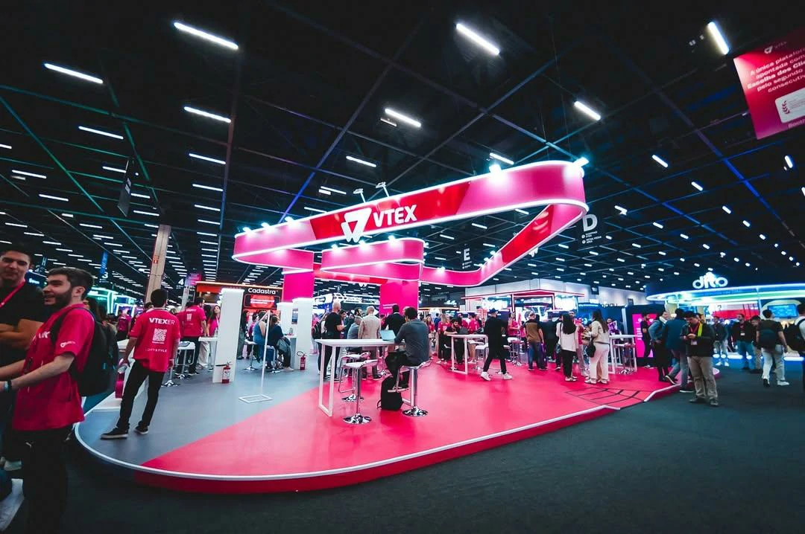
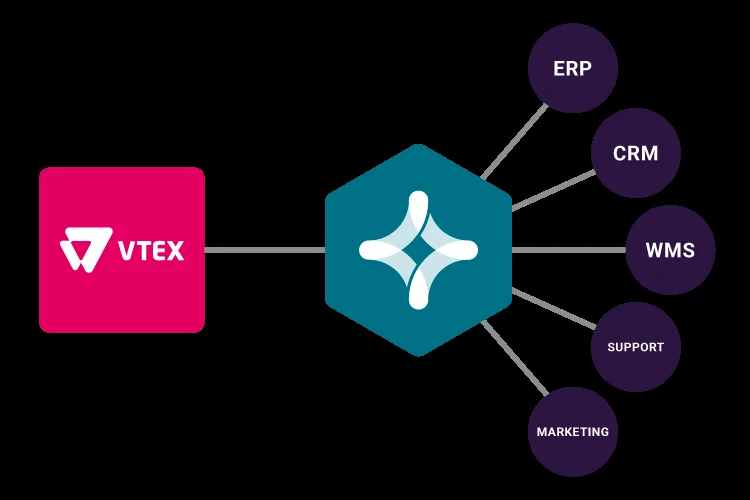

A VTEX apresentou uma mudança estratégica em sua plataforma: a inteligência artificial deixou de ser um recurso complementar e passou a ocupar o centro da operação.

O movimento marca uma mudança importante no comércio digital.

Não se trata apenas de tecnologia.

É uma mudança estrutural na forma como empresas operam vendas, atendimento e relacionamento com clientes.

Para empresas médias, isso pode representar ganho direto de eficiência e escala.

## O que a VTEX lançou na prática

Durante o VTEX Day 2026, a empresa apresentou uma nova arquitetura baseada em três pilares principais.

### Plataforma de comércio

Responsável pela operação central de vendas, pedidos e catálogo.

### Plataforma de experiência do cliente

Focada em personalização, relacionamento e retenção.

### Plataforma de monetização

Voltada para mídia interna, anúncios e novas fontes de receita.

O diferencial é que tudo agora opera conectado por inteligência artificial.

## A funcionalidade que muda o jogo: IA executando tarefas operacionais

A principal mudança não está apenas na análise de dados.

Está na execução.

A plataforma passa a operar tarefas que antes dependiam de equipes humanas.

## Geração automática de pedidos B2B

A inteligência artificial agora consegue gerar pedidos e cotações automaticamente.

### Como isso funciona

A partir de diferentes entradas:

- arquivos enviados por clientes  
- mensagens de texto  
- comandos de voz  

O sistema interpreta a demanda e transforma em pedido.

Isso reduz etapas manuais no processo comercial.

## Atendimento pós-venda automatizado

A plataforma também amplia a automação no pós-venda.

### O que a IA consegue resolver

Demandas como:

- status de pedidos  
- trocas  
- devoluções  

passam a ser tratadas automaticamente em grande parte dos casos.

Isso reduz carga operacional e melhora tempo de resposta.

## Personal shopper com IA

A VTEX também apresentou um modelo de vendedor digital baseado em inteligência artificial.

### O que ele faz

O sistema:

- conversa com o cliente  
- entende intenção de compra  
- recomenda produtos  
- conduz a jornada de compra  

Na prática, funciona como um vendedor digital escalável.

## O impacto real para empresas médias

A mudança afeta diretamente empresas que operam comércio digital com equipes enxutas.

## Redução de custo operacional

Processos antes manuais passam a ser automatizados.

Isso reduz a necessidade operacional em tarefas repetitivas.

## Aumento de conversão sem expansão de equipe

Com IA aplicada em vendas e atendimento, empresas podem escalar resultados sem ampliar estrutura.

Esse ponto é especialmente relevante para operações em crescimento.

## Integração operacional completa

Marketing, vendas e atendimento passam a operar de forma integrada.

### O ganho dessa integração

Isso reduz:

- retrabalho  
- perda de informação  
- atrasos operacionais  

e melhora a eficiência global da operação.

## O que o mercado está sinalizando

O movimento da VTEX reforça uma tendência clara.

A inteligência artificial está deixando de ser diferencial.

Está se tornando infraestrutura operacional.

Empresas que demorarem para adaptar seus processos podem perder competitividade.

## Onde começar dentro de uma empresa média

Nem toda empresa precisa transformar toda a operação de uma vez.

O caminho mais eficiente é começar por áreas de retorno mais rápido.

### Atendimento

Automação de dúvidas frequentes e suporte inicial.

### Vendas

Qualificação de leads e geração automática de pedidos.

### Pós-venda

Processos de acompanhamento, trocas e suporte automatizado.

Essas áreas costumam gerar impacto rápido.

## O novo padrão operacional do comércio digital

A tendência é clara.

A inteligência artificial está migrando do suporte operacional para o núcleo da operação.

Empresas que se movem primeiro tendem a ganhar:

- mais eficiência  
- mais velocidade  
- melhor margem operacional  

No médio prazo, isso deixa de ser inovação e passa a ser padrão competitivo.