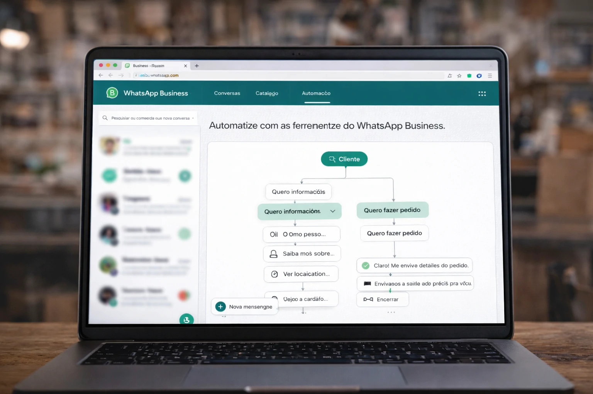

# WhatsApp Business ganha automações com IA e se torna peça central para pequenas empresas no Brasil

O WhatsApp Business está ampliando seu papel dentro das pequenas empresas brasileiras.

O aplicativo, que antes funcionava principalmente como canal de comunicação, está se transformando em uma plataforma operacional de vendas, atendimento e relacionamento com clientes.

Com novas automações e uso crescente de inteligência artificial, processos que antes exigiam equipe ou sistemas mais robustos agora podem ser executados dentro do próprio aplicativo.

Para pequenos negócios, isso representa ganho direto de escala e eficiência.

## Pequenas empresas estão transformando o WhatsApp em canal de operação

O uso do WhatsApp Business evoluiu rapidamente.

Hoje, empresas conseguem centralizar atendimento, vendas e relacionamento dentro de uma única ferramenta.

### O que já pode ser feito dentro do aplicativo

Entre as principais funções:

- atendimento automatizado  
- envio de propostas  
- catálogo de produtos  
- fechamento de vendas  
- suporte pós-venda  

Na prática, o aplicativo deixou de ser apenas um canal de conversa.

Virou uma ferramenta de negócio.

## O que mudou com automação e IA no WhatsApp

A evolução não veio apenas do próprio aplicativo.

O ecossistema ao redor também cresceu.

Ferramentas externas e integrações ampliaram as possibilidades.

### O que a automação permite hoje

Empresas conseguem:

- responder clientes automaticamente  
- qualificar leads  
- organizar pedidos  
- acompanhar status de atendimento  

Isso reduz tempo de resposta e melhora conversão.

## Como a automação funciona na prática

O uso do WhatsApp Web ampliou a capacidade operacional.

No computador, o atendimento ganha mais organização e escala.

### O que isso permite

Empresas conseguem:

- visualizar várias conversas simultaneamente  
- usar respostas rápidas  
- organizar contatos por etiquetas  
- integrar com sistemas simples de gestão  

Esse modelo transforma o WhatsApp em uma central de atendimento.

## Por que isso cresce tão rápido no Brasil

O Brasil tem uma característica única.

O WhatsApp já faz parte do comportamento diário de consumo e comunicação.

Isso reduz barreiras de adoção.

### O fator acessibilidade

Para pequenas empresas, o custo de entrada é baixo.

Não exige software complexo.

Não exige estrutura robusta.

E o cliente já está lá.

Esse fator acelera a adoção.

## O impacto real para pequenos negócios

A principal transformação está na produtividade.

Pequenos empreendedores conseguem operar com mais eficiência sem expandir equipe imediatamente.

### Ganho operacional

Automação reduz tarefas repetitivas.

### Ganho comercial

Respostas rápidas aumentam conversão.

### Melhor organização

Fluxos de clientes ficam mais claros e previsíveis.

Esse ganho de estrutura é relevante para negócios em crescimento.

## O novo diferencial competitivo

No passado, atendimento era baseado em disponibilidade manual.

Agora, eficiência operacional se torna o diferencial.

### Quem responde mais rápido vende mais

Tempo de resposta impacta diretamente conversão.

### Organização melhora retenção

Clientes bem atendidos tendem a voltar.

### Escala deixa de depender de contratação

Automação amplia capacidade operacional.

## Como começar agora

Mesmo negócios pequenos podem implementar melhorias rápidas.

### Configurar respostas automáticas

Ajuda no primeiro atendimento e dúvidas recorrentes.

### Organizar catálogo de produtos

Facilita apresentação comercial.

### Usar etiquetas de organização

Melhora controle de clientes e pedidos.

### Operar com WhatsApp Web

Amplia produtividade no atendimento.

O avanço do WhatsApp Business mostra uma tendência importante: pequenas empresas estão encontrando formas de operar com mais eficiência sem depender de sistemas complexos.

No mercado atual, velocidade de resposta e organização já se tornaram vantagem competitiva.