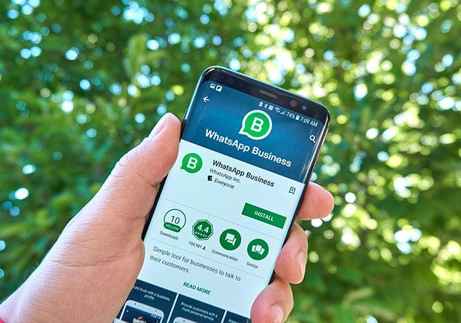

O WhatsApp Business está se tornando uma das principais ferramentas de vendas e atendimento para pequenas empresas no Brasil. Com novas funções de automação e inteligência artificial, o aplicativo começa a substituir processos que antes exigiam equipe ou sistemas mais complexos.

## Pequenas empresas estão automatizando atendimento direto no WhatsApp

Com o uso de respostas automáticas, catálogos e integração com sistemas, empresas conseguem atender clientes, enviar propostas e fechar vendas dentro do próprio aplicativo.

Na prática, o WhatsApp deixa de ser apenas comunicação e passa a ser um canal completo de negócio.

## O que mudou com a automação e IA no aplicativo

Ferramentas integradas e plataformas externas permitem responder clientes automaticamente, qualificar leads, organizar pedidos e acompanhar atendimento.

Isso reduz o tempo de resposta e melhora a experiência do cliente.

## Como funciona a automação na prática

Empresas já utilizam o WhatsApp também no computador para organizar o atendimento com mais controle.

É possível visualizar várias conversas ao mesmo tempo, aplicar respostas automáticas e integrar com sistemas simples de gestão.

Isso transforma o aplicativo em uma central de atendimento.

## Por que isso está crescendo no Brasil

Diferente de outros países, o Brasil já usa o WhatsApp como principal canal de comunicação.

Empresas pequenas encontram no aplicativo uma solução acessível, sem necessidade de investir em sistemas caros.

## O impacto real para pequenos negócios

A principal mudança é a redução de dependência de equipe.

Um pequeno empresário consegue atender mais clientes, organizar melhor o fluxo e aumentar as vendas sem precisar contratar imediatamente.

## O que isso significa na prática

Quem implementa automação consegue responder mais rápido, atender melhor e fechar mais negócios.

O diferencial deixa de ser atendimento manual e passa a ser eficiência.

## Como aplicar isso agora

Mesmo sem estrutura, é possível começar:

- configurar respostas automáticas  
- organizar catálogo de produtos  
- usar etiquetas para controlar clientes  
- usar WhatsApp Web para ganhar escala  